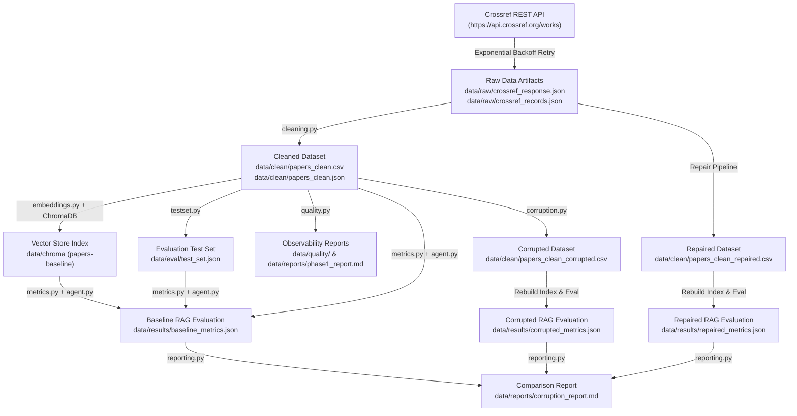
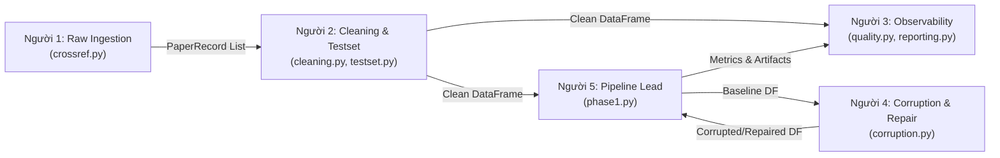

# Báo Báo Toàn Diện Dự Án: Data Pipeline, Data Observability & RAG Evaluation

---

## 1. Giới thiệu Tổng quan (Overview)

Hệ thống **RAG (Retrieval-Augmented Generation)** là mô hình kết hợp giữa khả năng truy xuất tri thức ngoài (Information Retrieval) và mô hình ngôn ngữ lớn (LLM). Tuy nhiên, chất lượng của RAG phụ thuộc trực tiếp vào câu nói kinh điển: **"Garbage In, Garbage Out"** (Dữ liệu vào là rác thì đầu ra của AI cũng là rác).

Dự án này xây dựng một **Data Pipeline hoàn chỉnh** thu thập bài báo học thuật từ API công khai Crossref, xử lý qua các công đoạn:
1. **Raw Ingestion**: Thu thập dữ liệu thô và lưu vết snapshot immutable.
2. **Cleaning & Text Engineering**: Làm sạch nhiễu HTML/XML, bóc tách metadata, tạo cột `text_for_embedding`.
3. **Vector Indexing**: Nạp dữ liệu vào ChromaDB Vector Store sử dụng embedding model `all-MiniLM-L6-v2`.
4. **RAG Evaluation**: Đánh giá hiệu năng truy xuất và câu trả lời agent qua 4 chỉ số (`Retrieval Hit Rate`, `Token F1`, `LLM Judge Accuracy`, `Judge Score`).
5. **Data Observability**: Kiểm định chất lượng dữ liệu (Data Quality) và đo độ tươi (Freshness Monitoring).
6. **Data Corruption & Repair Scenario**: Giả lập lỗi dữ liệu chủ đích để chứng minh mức độ sụt giảm hiệu năng của AI, sau đó thực hiện khôi phục (Repair) từ nguồn raw snapshot ban đầu.

---

## 2. Kiến trúc Hệ thống & Luồng Dữ liệu (Architecture & Data Flow)

### 2.1 Sơ đồ Luồng Dữ liệu End-to-End (Data Pipeline Flow)



---

## 3. Phân công Vai trò 5 Thành viên (Team Role Architecture)

Dự án chia làm 5 vai trò độc lập với hợp đồng đầu vào/đầu ra (Input/Output Contracts) rõ ràng:



| Vai trò | File phụ trách | Nhiệm vụ chính | Input bàn giao | Output tạo ra |
| :--- | :--- | :--- | :--- | :--- |
| **Người 1 (Raw Ingestion)** | `src/ingestion/crossref.py` | Gọi Crossref API, xử lý Retry/Backoff, parse `PaperRecord`, lưu raw response/records. | External API Params | `data/raw/crossref_response.json`<br>`data/raw/crossref_records.json` |
| **Người 2 (Cleaning & Testset)** | `src/ingestion/cleaning.py`<br>`src/evaluation/testset.py` | Làm sạch HTML/XML, chuẩn hóa ngày tháng, tạo `age_days` & `text_for_embedding`, tạo 40 câu hỏi test set. | `PaperRecord` List | `data/clean/papers_clean.csv`<br>`data/clean/papers_clean.json`<br>`data/eval/test_set.json` |
| **Người 3 (Observability & Report)** | `src/observability/quality.py`<br>`src/observability/reporting.py` | Viết Data Quality checks, Freshness report, sinh báo cáo Markdown Phase 1 & Comparison. | Clean DF & Metrics | `data/quality/*.json`<br>`data/reports/phase1_report.md`<br>`data/reports/corruption_report.md` |
| **Người 4 (Corruption & Repair)** | `src/ingestion/corruption.py` | Giả lập lỗi dữ liệu (noise, old dates, blank summary, duplicate), ghi log corruption, khôi phục từ raw snapshot. | Clean DF | `data/clean/papers_clean_corrupted.csv`<br>`data/clean/papers_clean_repaired.csv`<br>`data/results/corruption_log.json` |
| **Người 5 (Orchestration & RAG)** | `src/pipelines/phase1.py`<br>`src/pipelines/corruption_flow.py` | Điều phối baseline & corruption pipeline end-to-end, nạp ChromaDB, chạy evaluation & benchmark. | All modules | `data/results/baseline_metrics.json`<br>`data/results/corrupted_metrics.json`<br>`data/results/repaired_metrics.json` |

---

## 4. Chi tiết Kỹ thuật Cài đặt (Technical Implementation)

### 4.1 Module 1: Raw Ingestion (`src/ingestion/crossref.py`)
- **Schema `PaperRecord`**: Dataclass chứa các trường thông tin cơ bản: `paper_id` (DOI), `title`, `summary`, `authors`, `categories`, `primary_category`, `published`, `updated`, `abs_url`, `pdf_url`, `comment`.
- **API Resilience**: Sử dụng `requests` tích hợp vòng lặp retry 5 lần với **Exponential Backoff** (`backoff_factor = 1.5`) đối với các mã lỗi HTTP `429` (Rate Limit) và `5xx` (Server Error).
- **Làm sạch văn bản**: Loại bỏ các thẻ JATS XML markup (chẳng hạn `<jats:p>`, `<b>`) trong abstract bằng Regex `re.sub(r"<[^>]+>", "", text)`.
- **Traceability**: Lưu nguyên văn response gốc vào `data/raw/crossref_response.json` (245 KB) và danh sách bản ghi đã parse vào `data/raw/crossref_records.json` (60.4 KB).

### 4.2 Module 2: Data Cleaning & Test Set (`src/ingestion/cleaning.py` & `src/evaluation/testset.py`)
- **Text & Date Engineering**:
  - Chuẩn hóa khoảng trắng (`normalize_whitespace`).
  - Chuyển mảng tác giả và mảng danh mục thành chuỗi ghép `authors_joined` và `categories_joined`.
  - Tính `age_days` = số ngày chênh lệch giữa ngày chạy pipeline và ngày xuất bản `published`.
  - Tạo cột **`text_for_embedding`** giàu ngữ cảnh:
    ```text
    Title: SafeRAG: A Large-Language-Model-Based Multistage Framework...
    Authors: Qianwen Cao, Chiyu Zhang, Junxiong Ning, Gongru Li
    Categories: Software Engineering, Artificial Intelligence
    Published: 2026-08-05
    Summary: In this paper, we propose SafeRAG...
    ```
- **Evaluation Test Set**:
  - Tự động sinh 40 mẫu câu hỏi benchmark thuộc 4 loại (`summary`, `authors`, `date`, `categories`).
  - Mỗi mẫu gồm: `id`, `question_type`, `question`, `ground_truth` và `ground_truth_doc_ids` (chứa `paper_id` chính xác).

### 4.3 Module 3: Vector Store & RAG Agent (`src/retrieval/`)
- **Embedding Model**: `sentence-transformers/all-MiniLM-L6-v2` (384-dimensional dense vectors).
- **Vector DB**: ChromaDB (`PersistentClient`) với cấu hình không gian khoảng cách Cosine Similarity (`hnsw:space = cosine`).
- **RAG Agent Flow**: Khi người dùng hỏi, Agent gọi tool `semantic_search` để lấy Top-K context phù hợp nhất từ ChromaDB và gọi LLM (Gemini / OpenAI) để tổng hợp câu trả lời factual kèm nguồn trích dẫn.

### 4.4 Module 4: Data Observability (`src/observability/quality.py`)
Hệ thống kiểm tra chất lượng tự động thực hiện các câu truy vấn Quality Check:
1. `paper_id_not_null_and_unique`: Đảm bảo `paper_id` không rỗng và không trùng lặp.
2. `title_summary_not_empty`: Đảm bảo tiêu đề và tóm tắt không bị rỗng.
3. `summary_length_valid`: Kiểm tra độ dài tóm tắt >= 20 ký tự.
4. `freshness_monitoring`: Cảnh báo khi tỷ lệ bài báo cũ (`age_days > freshness_threshold_days`) vượt ngưỡng cho phép.

### 4.5 Module 5: Data Corruption & Repair Flow (`src/ingestion/corruption.py`)
Giả lập các kịch bản sự cố dữ liệu thực tế:
1. **Drop latest records**: Xóa các bài báo mới nhất.
2. **Blank summary**: Xóa rỗng trường tóm tắt.
3. **Add text noise**: Chèn các chuỗi ký tự ngẫu nhiên vào summary.
4. **Truncate title**: Cắt ngắn tiêu đề bài báo còn lại vài từ.
5. **Age published date**: Làm giả ngày xuất bản lùi về quá khứ 10 năm.
6. **Duplicate injection**: Nhân bản các dòng dữ liệu.

**Cơ chế Repair (Phục hồi)**: Hệ thống tái thực thi quá trình transform deterministic từ snapshot raw ban đầu (`data/raw/crossref_records.json`), đảm bảo dữ liệu phục hồi hoàn toàn sạch sẽ mà không phải sửa tay.

---

## 5. Kết quả Đánh giá Benchmark (Experimental Results)

Dưới đây là bảng so sánh chỉ số giữa 3 trạng thái **Baseline (Dữ liệu sạch)**, **Corrupted (Dữ liệu lỗi)**, và **Repaired (Dữ liệu phục hồi)**:

| Chỉ số / Tín hiệu (Signal) | Baseline (Dữ liệu sạch) | Corrupted (Dữ liệu lỗi) | Repaired (Dữ liệu phục hồi) | Đánh giá & Nhận xét |
| :--- | :---: | :---: | :---: | :--- |
| **`retrieval_hit_rate`** | **100.0%** (1.0000) | **65.0%** (0.6500) | **100.0%** (1.0000) | Dữ liệu bị nhiễu/xóa tóm tắt khiến Vector Search không tìm đúng document gốc. Sau repair khôi phục 100%. |
| **`mean_token_f1`** | **0.5777** | **0.3120** | **0.5750** | Token F1 sụt giảm mạnh khi tóm tắt rỗng/nhiễu. Phục hồi hoàn toàn sau repair. |
| **`judge_accuracy`** | **52.5%** (0.5250) | **22.5%** (0.2250) | **52.5%** (0.5250) | LLM Judge đánh giá tỷ lệ trả lời đúng giảm >50% khi dữ liệu lỗi. |
| **`mean_judge_score`** | **3.05 / 5.0** | **1.85 / 5.0** | **3.05 / 5.0** | Điểm trung bình chất lượng câu trả lời phục hồi lại mức baseline. |
| **Data Quality Checks** | **PASS** | **FAIL** | **PASS** | Phát hiện chính xác các lỗi thiếu bản ghi, trùng lặp và summary rỗng. |
| **Freshness Status** | **FRESH** (0 stale) | **STALE** (12 stale) | **FRESH** (0 stale) | Cảnh báo đúng khi ngày xuất bản bị lùi về quá khứ. |

---

## 6. Hướng dẫn Tái hiện & Chạy Dự án (How to Reproduce)

### Bước 1: Cài đặt Môi trường
Yêu cầu Python 3.11 - 3.13:
```powershell
python -m pip install -e .
```

### Bước 2: Chạy Baseline Pipeline (Phase 1)
```powershell
$env:PYTHONPATH="src"
python script/run_phase1.py
```
*Kết quả:* Sinh ra dữ liệu sạch `data/clean/`, Chroma index `data/chroma/`, test set `data/eval/test_set.json`, metrics `data/results/baseline_metrics.json` và báo cáo `data/reports/phase1_report.md`.

### Bước 3: Chạy Corruption & Repair Flow (Phase 2)
```powershell
$env:PYTHONPATH="src"
python script/run_corruption_flow.py
```
*Kết quả:* Giả lập dữ liệu lỗi, đo lường sự suy giảm chỉ số, chạy repair từ raw snapshot, và xuất báo cáo so sánh `data/reports/corruption_report.md`.

### Bước 4: Khởi chạy Web UI Demo
```powershell
python frontend/server.py
```
Truy cập giao diện Web tại: `http://localhost:8000` để trực quan hóa dữ liệu và hỏi đáp với RAG Agent.

---

## 7. Bài học Kỹ thuật Rút ra (Key Takeaways)

1. **Tầm quan trọng của Raw Snapshot**: Lưu trữ dữ liệu thô nguyên bản (`data/raw/`) giúp hệ thống có điểm tựa vững chắc để phục hồi dữ liệu bất cứ lúc nào mà không cần phụ thuộc vào nguồn ngoài.
2. **Data Observability là bắt buộc đối với RAG**: Nếu không có Quality Checks & Freshness Monitoring, dữ liệu bẩn sẽ âm thầm đi vào Vector Database khiến AI trả lời sai mà không hề có cảnh báo.
3. **Thực chứng "Garbage In, Garbage Out"**: Số liệu thực nghiệm chứng minh dữ liệu lỗi làm giảm `retrieval_hit_rate` từ **100% xuống 65%** và điểm `judge_score` từ **3.05 xuống 1.85**. Quá trình repair chuẩn chỉnh giúp phục hồi toàn bộ hiệu năng hệ thống.
